# Environment Setup and Initial Deployment

## 🚀 Quick Start

* **Duration:** 2 hours hands-on workshop
* **What you'll build:** A simple SAP BTP application with security features
* **Prerequisites:** Web browser, SAP BTP Trial Account
* **Setup time:** ~30 minutes
* **Start here:** [Step 1: Set Up Your Trial Account](#step-1-set-up-your-trial-account)

## Set up Process flow Diagram
  <p align="center">
    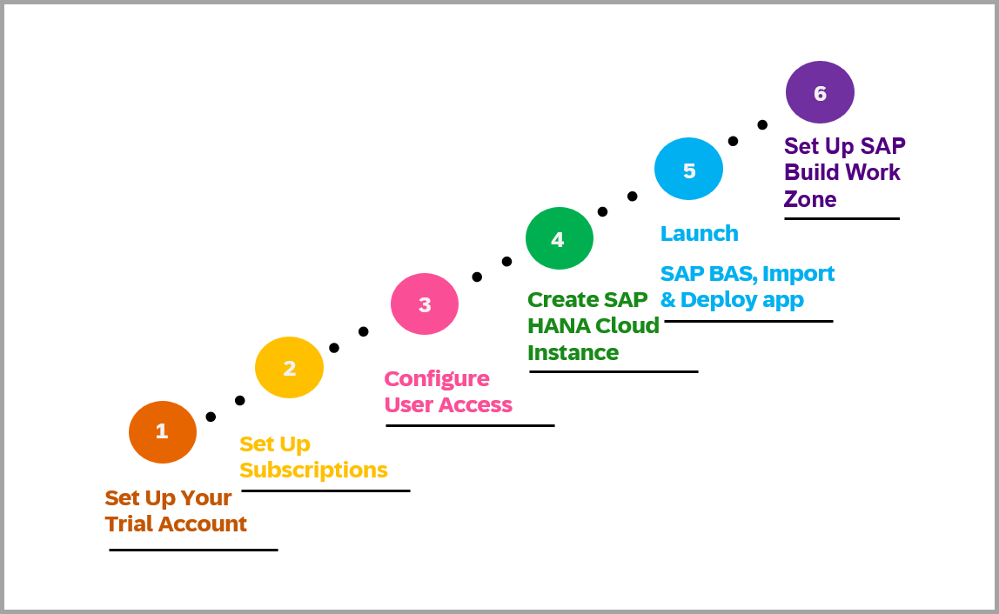
    <br>
    <b></b>
  </p>
    
## Table of Contents

- [Overview](#overview)
  - [Business Scenario](#business-scenario)
  - [Solution Diagram](#solution-diagram)
- [Step 1. Set Up Your BTP Trial Account](#step-1-set-up-your-trial-account)
- [Step 2. Set Up Subscriptions](#step-2-set-up-subscriptions)
   - [2.1. Subscribe to SAP HANA Cloud (Trial)](#21-subscribe-to-sap-hana-cloud-trial)
   - [2.2. Subscribe to Cloud Identity Services (Trial)](#22-subscribe-to-cloud-identity-services-trial)
   - [2.3. Establish Trust with SAP Cloud Identity (Trial)](#23-establish-trust-with-sap-cloud-identity-trial)
   - [2.4. Subscribe to SAP Build Work Zone, Standard Edition (Trial)](#24-subscribe-to-sap-build-work-zone-standard-edition-trial)
- [Step 3. Configure Users access](#step-3-configure-users-access)
     - [3.1. Import business users into SAP cloud identity](#31-import-business-users-into-sap-cloud-identity)
     - [3.2. Set Initial Password For Business Users](#32-set-initial-password-for-business-users)
     - [3.3. Map IAS Users to BTP Subaccount](#33-map-ias-users-to-the-btp-subaccount)
     - [3.4. Configure Role Collections](#34-configure-role-collections)
- [Step 4: Create SAP HANA Cloud Instance](#step-4-create-sap-hana-cloud-instance)
     - [4.1. Identify your Organization and Space IDs](#41-identify-your-organization-and-space-ids)
     - [4.2. Create the SAP HANA Cloud Instance](#42-create-the-sap-hana-cloud-instance)
- [Step 5. Launch SAP BAS, Import Project, and Deploy to Cloud Foundry](#step-5-launch-sap-bas-import-project-and-deploy-to-cloud-foundry)
     - [5.1. Create a Dev Space](#51-create-a-dev-space)
     - [5.2. Download and Import the Project](#52-download-and-import-the-project)
     - [5.3. Build and Deploy the Application to Cloud Foundry](#53-build-and-deploy-the-application-to-cloud-foundry)
     - [5.4. Assign Role Collections to Business Users](#54-assign-role-collections-to-business-users)
- [Step 6. Integrate Your Application with SAP Build Work Zone, Standard Edition](#step-6-integrate-your-application-with-sap-build-work-zone-standard-edition)
     - [6.1. Update Content](#61-update-content)
     - [6.2. Add Application to Content Explorer](#62-add-application-to-content-explorer)
     - [6.3. Create a Group](#63-create-a-group)
     - [6.4. Add Application to the Everyone Role](#64-add-application-to-the-everyone-role)
     - [6.5. Create a Site](#65-create-a-site)
     - [6.6. Verify Access with Different Users](#66-verify-access-with-different-users)
     
## Overview 

In these hands-on exercises, we will be using the Incident Management Application, which is designed as a reference application for the [SAP BTP Developer's Guide](https://help.sap.com/docs/btp/btp-developers-guide/btp-developers-guide). It showcases best practices for developing applications on SAP Business Technology Platform (SAP BTP).

- ⚠️ **Note:** To keep this page open, right-click each link and choose **"Open link in new tab"**.

### Business Scenario
Bestrun, a leading electronics company, uses this application to manage customer service incidents. The application supports the following business process:
  1. A customer contacts Bestrun's call center with an issue.
  2. A call center representative (processor) receives the call.
  3. The representative creates a new incident in the system based on the customer's complaint.
  4. The conversation details are recorded as part of the incident.

### Solution Diagram
The solution diagram illustrates the key components and their interactions within the Incident Management Application deployed on SAP Business Technology Platform (SAP BTP).

  <p align="center">
    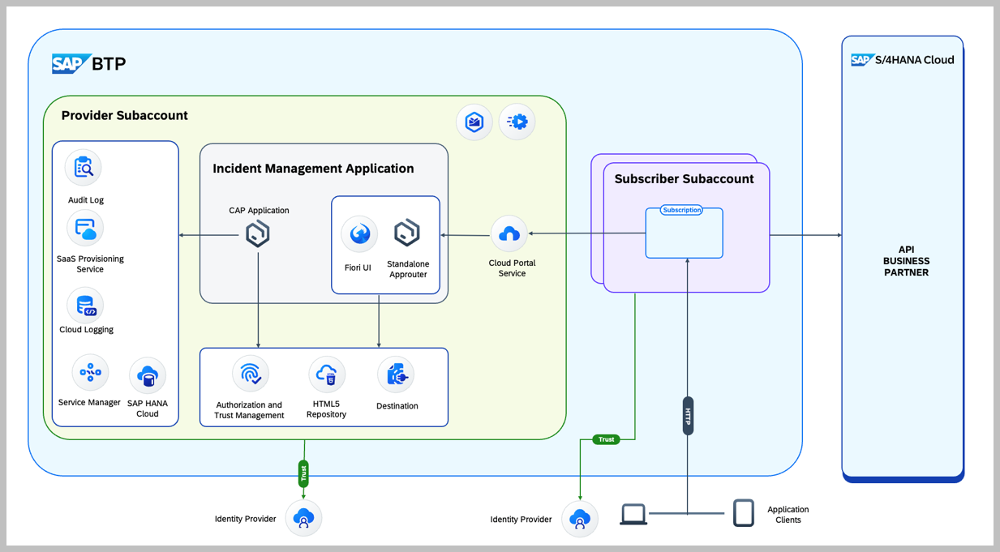
    <br>
    <b></b>
  </p>

## Step 1. Set Up Your Trial Account

1. Navigate to the [SAP BTP Trial Sign-Up/Login Page](https://account.hanatrial.ondemand.com/).
2. If you don't have a trial account:
    - Click Sign Up and follow the prompts to create your account using your email.
    - Verify your email address to complete registration.
3. When prompted, select US East as the region .
  <p align="center">
    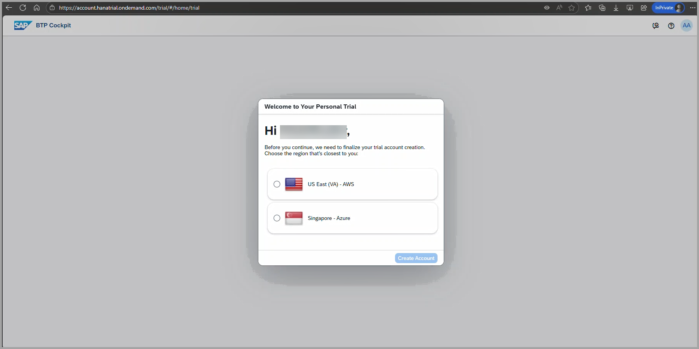
    <br>
    <b></b>
  </p>
4. Click on the button "Go To Your TZrial Account"
5. Click on the subaccount tile (typically labeled trial) to open the SAP BTP Cockpit for your trial subaccount.
  <p align="center">
    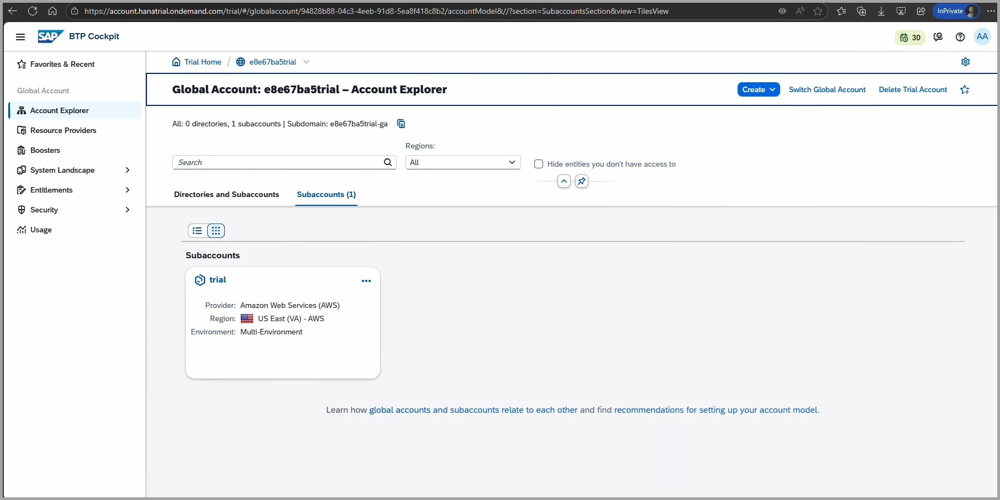
    <br>
    <b></b>
  </p>

## Step 2. Set Up Subscriptions

In this step, you will set up the required application subscriptions

| Application                           | Subscription Plan             | Purpose             |
| :------------------------------       | :--------------- | :---------------    |
| [SAP HANA Cloud](https://discovery-center.cloud.sap/protected/index.html#/serviceCatalog/sap-hana-cloud/?region=all)              | tools             |Provides the database administration tools.|
| [Cloud Identity Services](https://discovery-center.cloud.sap/serviceCatalog/cloud-identity-services/?region=all)       | default |Manages user authentication|
| [SAP Build Work Zone, standard edition](https://discovery-center.cloud.sap/serviceCatalog/sap-build-work-zone-standard-edition/?region=all) | standard         |The Launchpad where you will access your deployed app.|
| [SAP Business Application Studio](https://discovery-center.cloud.sap/serviceCatalog/business-application-studio/?region=all) | standard         |Development environment for building, testing, and deploying cloud applications.|

  ⚠️ **Note:** 
  - Your Trial account comes pre-configured with [SAP Business Application Studio](https://discovery-center.cloud.sap/serviceCatalog/business-application-studio/?region=all) (subscribed) and the
    [Cloud Foundry Environment](https://discovery-center.cloud.sap/protected/index.html#/serviceCatalog/cloud-foundry-runtime?region=all) (enabled). You do not need to add these manually.
  
### 2.1. Subscribe to SAP HANA Cloud (Trial)
  1. From your Trial Subaccount (Cockpit), look at the navigation menu on the left.
  2. Click on **Services->Service Marketplace**.
  3. Search for **"SAP HANA Cloud"**.
  4. Click the three-dot menu **(...)** next to the service name, then choose **Create**.
  5. In the Create Subscription wizard:
      * Confirm Service is set to "SAP HANA Cloud"
      * Select **Subscription Plan: tools** (free Trial plan)
      * Click **Create**.
  6. Once the subscription process has finished, confirm that the **Status** is **"Subscribed"**

### 2.2. Subscribe to Cloud Identity Services (Trial)
Trial accounts have a pre-linked Identity Authentication (IAS) tenant, so subscription and instance setup are simplified:
  1. Return to the **Service Marketplace** in your subaccount.
  2. Search for **"Cloud Identity Services"**.
  3. Click the three-dot menu **(...)** next to the service name, then choose **Create**.
  4. In the Create Subscription wizard:
      * Confirm Service is set to **"Cloud Identity Services"**
      * Select **Subscription Plan: default**.
      * Click **Create** to initiate the subscription.
  5. Once the subscription process has finished, confirm that the **Status** is **"Subscribed"**
  6. Activate your IAS Administration Console access via email:
      * Check your registered email inbox (including spam/junk folders) for an activation message from SAP Cloud Identity Services.
      * Click the activation link in the email, follow the prompts to set a secure password, and log into the Identity Authentication Administration Console to confirm access.
      * This step is required for advanced user management later, including adding business users to access your SAP Build Work Zone and deployed applications.

  <p align="center">
    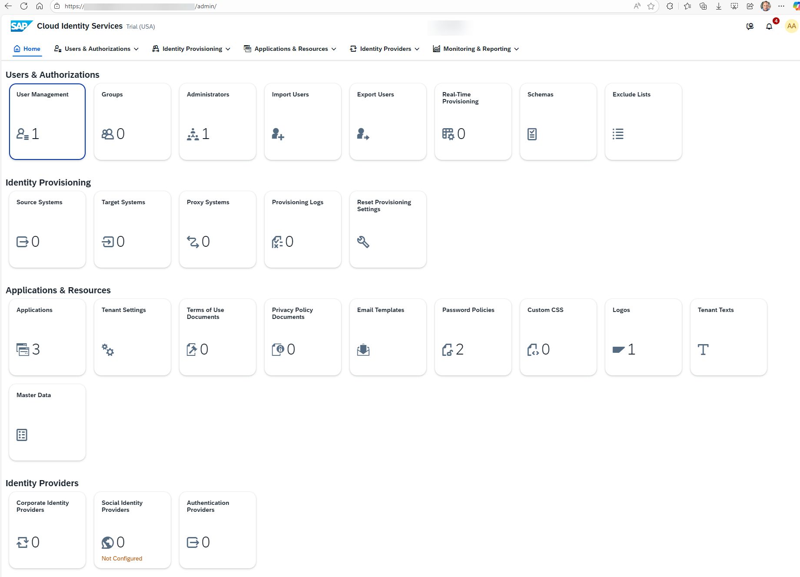
    <br>
    <b></b>
  </p>

### 2.3. Establish Trust with SAP Cloud Identity (Trial)
Establishing trust allows SAP Cloud Identity Services to act as your central identity provider, enabling secure Single Sign-On (SSO) and centralized management of business users. This connection is a technical requirement for services like SAP Build Work Zone to authenticate users and correctly assign the role collections needed to access applications.

  1. **Navigate to Trust Configuration:** In your BTP subaccount, go to **Security > Trust Configuration**.
  2. **Initiate Trust Setup:** Click the **Establish Trust** button.
  3. **Choose Tenant:** In the wizard, select your pre-linked SAP Cloud Identity tenant and click **Next**.
  4. **Complete and Review:** Follow the remaining steps for **"Configure Main Information"** and **"Configure Identiy provider and Parameters"**, keep the default values in all steps and click on next, then click **Finish** to activate the trust.

  <p align="center">
    
    <br>
    <b></b>
  </p>

### 2.4. Subscribe to SAP Build Work Zone, Standard Edition (Trial)
⚠️ **Note:** 
SAP Work Zone, standard edition requires a custom Identity Authentication Service (IAS) tenant for user authentication. You cannot use the default SAP ID Service as the identity provider for Work Zone, standard edition. 
That is why in the previous step, you configured a dedicated custom IAS tenant and connected it to your SAP BTP subaccount.

  1. Return to the **Service Marketplace** in your subaccount.
  2. Search for **"SAP Build Work Zone, standard edition"**.
  3. Click the three-dot menu **(...)** next to the service name, then choose **Create**.
  4. In the Create Subscription wizard:
      * Confirm Service is set to "SAP Build Work Zone, standard edition"
      * Select **Subscription Plan: standard**
      * Click on **Create**
  5. Once the subscription process has finished, confirm that the **Status** is **"Subscribed"**

At the conclusion of [Step 2: Set Up Subscriptions](#step-2-set-up-subscriptions), your Subscriptions tab will display the complete list of successfully subscribed required services, exactly as illustrated in the following image:

  <p align="center">
    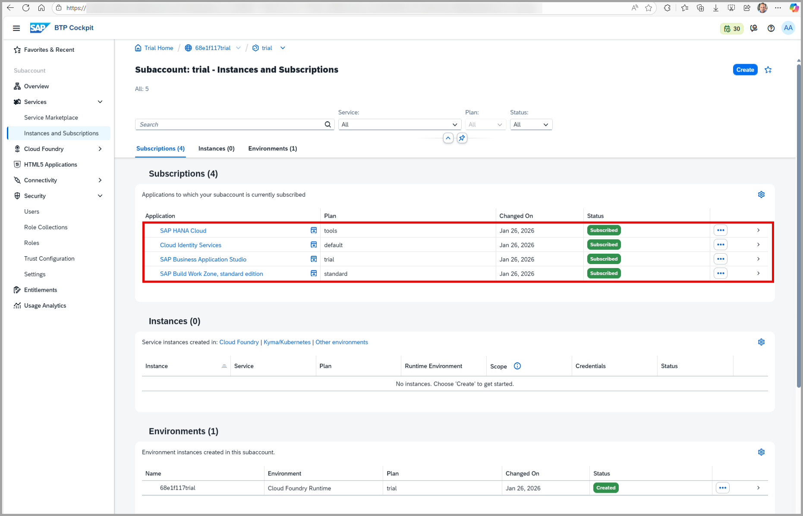
    <br>
    <b></b>
  </p>

## Step 3. Configure Users access
This section details how to manage users and their access rights within your SAP BTP trial landscape, leveraging SAP Cloud Identity Services (Identity Authentication Service - IAS) as your identity provider.

⚠️ **Note:** 
The BTP Trial landscape only supports default SAP-managed identity providers. Users originating from a custom IAS tenant cannot be used as platform users to access or log in to the BTP Trial environment.

### 3.1. Import Business Users into SAP Cloud Identity.
  1. Download user data file [IAS-business-users.csv](https://github.com/SAP-samples/btp-secure-development/releases/download/v1.0.0/IAS-business-users.csv)
  2. Open your web browser and navigate to your IAS tenant's administration console. The URL typically looks like https://<your_tenant_id>.accounts.ondemand.com/admin.
  3. Enter your administrator credentials and log in.
  2. From the main Dashboard, click on the **Import Users** tile.
  3. Click the **Browse** button to select your IAS-business-users.csv file.
  4. Click the **Import** button at the top right.
  5. Click **Import** button on the message box **Confirm**.

### 3.2. Set initial Password for Business users
  1. In the **User Management** screen, search for and click on a user (e.g., alice.jones@bestrun.com).
  2. Navigate to the **Authentication** tab.
  3. Click on **Password Details**.
  4. Click on **Set Initial** to manually type a temporary password (e.g., dsagH@0326) that you will give to the user.
  5. Repeat this for all imported users (bob.smith@bestrun.com, david.miller@bestrun.com).

### 3.3. Map IAS Users to the BTP Subaccount

To authorize the users you just created in IAS, you must register them within your specific BTP Subaccount.

1. Open the **SAP BTP Cockpit** and navigate to your Subaccount.
2. In the left navigation pane, expand **Security** and select **Users**.
3. Click the **Create** button to open the user mapping dialog.
4. Identity Provider: Select your IAS tenant from the dropdown (e.g., xxxxxx.accounts.ondemand.com(business users)).
5. User Name, E-mail: Enter the user's email address (e.g., alice.jones@bestrun.com). This must match the email used in the IAS import.
6. Click **Create** to finalize.

Repeat this process for each of the following users:
  * bob.smith@bestrun.com (Support user)
  * alice.jones@bestrun.com (Support user)
  * david.miller@bestrun.com (Admin user)

To add your IAS admin user (Trial user email):
  * Repeat the steps above
  * Use the email address of your IAS admin account (e.g., admin@yourcompany.com)
  * Ensure the Identity Provider matches your custom IAS tenant.
  
### 3.4. Configure Role Collections
To ensure you have full administrative rights to manage the development tools, assign the following role collections to your identity-provider user admin.

⚠️ **Note:** 
If your custom IAS admin user is not listed in the users' list, click **Create** to add the user first, ensuring you select your custom Identity Provider from the dropdown.

1. In the **SAP BTP Cockpit**, go to your **trial subaccount**.
2. On the left-side menu, navigate to **Security → Users**.
3. Click your IAS admin-user email to open the details page.
4. Verify that the **Identity Provider** field shows your IAS tenant.
5. Click **Assign Role Collection**.
6. Search for and select these roles:
   - **`Business_Application_Studio_Administrator`**
   - **`Business_Application_Studio_Developer`**
   - **`Business_Application_Studio_Extension_Deployer`**
   - **`Launchpad_Admin`**
   - **`SAP HANA Cloud Administrator`**
   - **`Subaccount Viewer`**
7. Click **Assign**.

## Step 4. Create SAP HANA Cloud Instance
In this step, you will provision a new SAP HANA Cloud database instance and map it to your Cloud Foundry environment. This allows your applications and development tools (like SAP Business Application Studio) to interact with the database.

### 4.1. Identify your Organization and Space IDs
Before creating the instance, you need to know where it will be mapped.
  1. In your **SAP BTP Cockpit**, go to your **Trial Subaccount > Overview**.
  2. Click on **Cloud Foundry Environment** tab.
  3. Locate and copy the **Org ID** (a long GUID, e.g., ceae01ac-759a-4e56-8ac8-ef4a0a8b9fa2).

   <p align="center">
    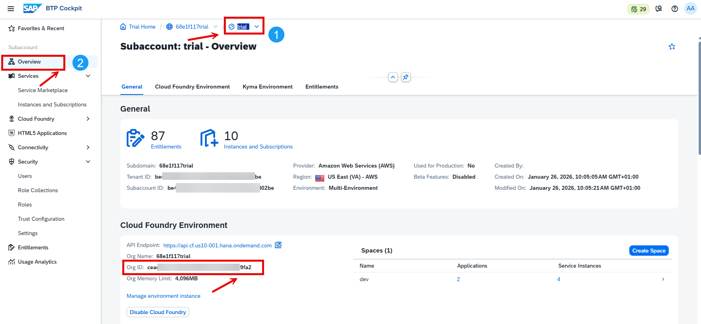
    <br>
    <b></b>
  </p>

  6. Go to **Cloud Foundry -> Spaces**, then click on your space (e.g., dev).
  7. Copy the Space ID from the URL:
      - Look at your browser's address bar. The URL format is:**../org/\<ORG-ID\>/space/\<SPACE-ID\>/applications**
      - Copy the alphanumeric string after **/space/** and before **/applications**, e.g,84304933-24e6-popo-950a-46105da935d0
  8. Save both IDs for [Step 4.2 Create the SAP HANA Cloud Instance](#42-create-the-sap-hana-cloud-instance).

### 4.2. Create the SAP HANA Cloud Instance
1. Navigate to **Services > Instances and Subscriptions**.
2. Find **SAP HANA Cloud** under the **Subscriptions tab** and click the **Go to Application** icon to open **SAP HANA Cloud Central**.
3. If you are prompted for login, choose the **custom IDP** and login with your admin user.
4. In the new tab, click **Create Instance**.

* **Step 1. Type:**
    * Select **SAP HANA Cloud** in **Instance Type**
    * Select **Configure manually** from the **Instance Configuration** options.
    * Click **Next** Step.

* **Step 2. SAP HANA Database: General**
    * **Instance Name**: e.g., hanadb.
    * **Administrator Password:** Set a strong password for the DBADMIN user.
    * Click **Next** Step.

* **Step 3. SAP HANA Database: Sizes and Availability**
    * Leave default trial sizing and availability settings unchanged.
    * **Next** Step.

* **Step 4. SAP HANA Database: Connections**
    * Under **Allowed Connections**, select **Allow all IP addresses**. This is required for trial and development access.
    * Click **Next** Step.

* **Step 5. SAP HANA Database: Advanced Settings**
    * Keep default settings for **Version** and **Additional Features**.
    * **Instance Mapping**
        * Click **Add Mapping**.
        * **Environment Type:** Keep default as **Cloud Foundry**.
        * Paste your **Organization ID** and **Space ID** (copied from [Step 4.1 Identify your Organization and Space IDs](#41-identify-your-organization-and-space-ids)) into the **Environment Instance ID** and **Environment Group** fields.
        * Click Next Step.

* **Step 6. Data Lake: general**
    *  Keep default settings for **Create Data Lake**.
    *  Click **Review and Create**.

* **Step 7. Review New Instances**
    * Verify all details, especially the Instance Mapping configuration.
    * Click **Create Instance**.
   
* **Step 8. Verify Instance Creation**
    * Wait for the instance to be provisioned. This may take several minutes.
    * Once complete, you will see your instance (e.g., hanadb) listed in the All Instances view with a 🟢 **Running** status (green indicator).
    * Confirm the Type shows SAP HANA Database and the instance is ready for use.

  <p align="center">
    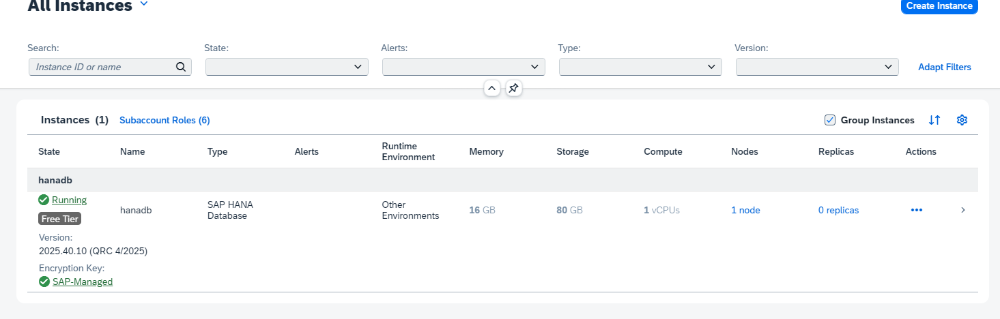
    <br>
    <b></b>
  </p>

## Step 5. Launch SAP BAS, Import Project, and Deploy to Cloud Foundry
### Oveview
In this step, you will use SAP Business Application Studio (BAS) to import, build, and deploy the Secure Incident Management application to your Cloud Foundry environment on SAP BTP.

SAP Business Application Studio is a modern, cloud-based development environment designed for building and extending SAP applications. It provides preconfigured dev spaces that include all required tools, runtimes, and extensions for full-stack cloud application development.

During this step, you will:

* Create a dedicated BAS dev space for the application.
* Import the provided project archive into BAS.
* Build and deploy the application to Cloud Foundry using either the BAS UI or the command line.
* Ensure the application is accessible by assigning the required user role collections.

By the end of this step, the Secure Incident Management application will be successfully deployed on SAP BTP Cloud Foundry, and authorized users will be able to access and use it.

### 5.1. Create a Dev Space:

1. Open SAP Business Application Studio (BAS) from your BTP Cockpit.

    * Navigate to **Services > Instances and Subscriptions**.
    * Find **SAP Business Application Studio** under the **Subscriptions** tab and click the **Go to Application** icon.

  <p align="center">
      
      <br>
      <b></b>
  </p>
  
2. If prompted for login, select your Custom Identity Provider (IdP) and sign in with your admin user.

  <p align="center">
      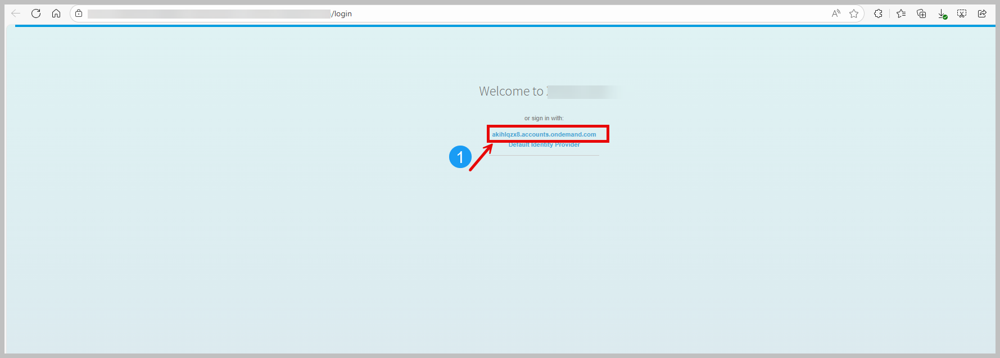
      <br>
      <b></b>
  </p>
    
3. Click **Create Dev Space**.
4. Enter the **Dev Space name: secure_incident_management**.
5. Select **Full Stack Cloud Application** as the application type.
6. Click **Create Dev Space**.

  <p align="center">
    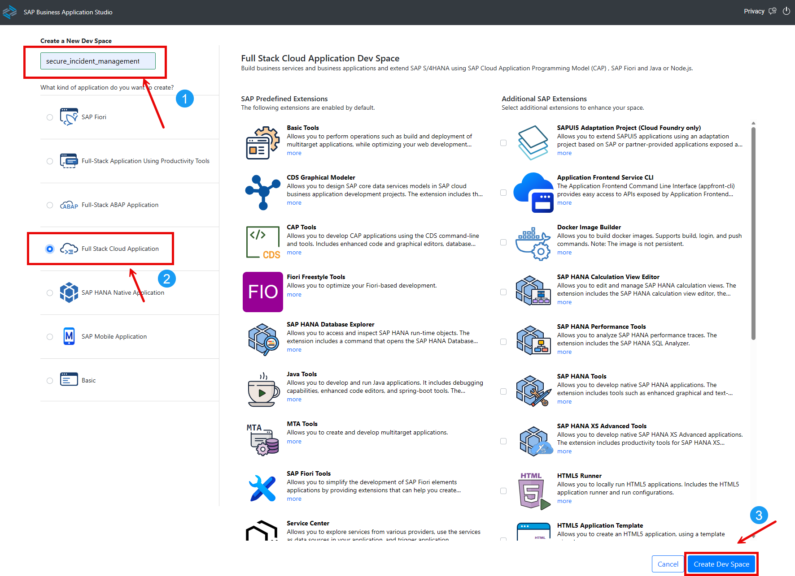
    <br>
    <b></b>
  </p>

7. Wait for the Dev Space **status** to change to **Running**, then click on the Dev Space name to open it.
<p align="center">
  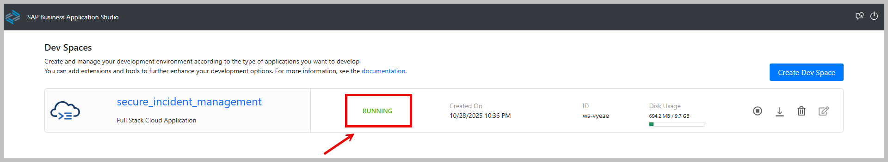
  <br>
  <b></b>
</p>

### 5.2. Download and Import the Project
1. Download the project file secure-incident-management.tar from the following link:
  👉 [Download Secure Incident Management Project](https://github.com/SAP-samples/btp-secure-development/releases/download/v1.0.0/secure-incident-management.tar)
2. Save the file locally on your machine. This archive will be imported into SAP Business Application Studio in the next step.
3. In the BAS Explorer pane, click **Import** Project.
4. Select the secure-incident-management.tar file from your local machine and import it.
<p align="center">
  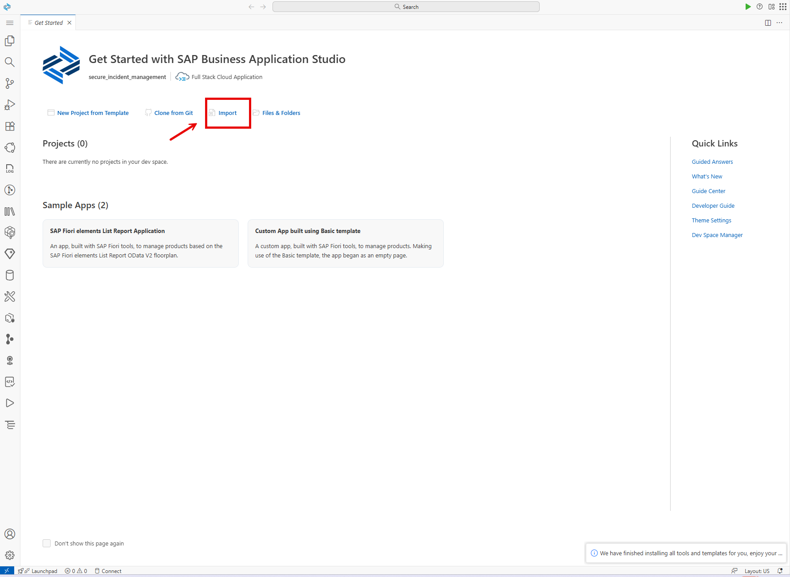
  <br>
  <b></b>
</p>

5. Wait for the status bar at the bottom of SAP BAS to confirm completion before proceeding to the next steps.
6. The import is complete only when the project folder appears in the Project Explorer and its structure (such as mta.yaml) is fully loaded.
7. Bookmark your **SAP Business Application Studio** link.
   
### 5.3. Build and Deploy the Application to Cloud Foundry
Before you build and deploy the application, it's crucial to ensure all project dependencies are up-to-date.

### 5.3.1. Prepare for Deployment (Run npm update)

**1. Open the Integrated Terminal:** If you haven't already, open the terminal by navigating to **Hamburger menu → Terminal → New Terminal**, or by right-clicking on the project name in the Project Explorer and selecting **Open in Integrated Terminal**.

<p align="center">
  
  <br>
  <b></b>
</p>

**2. Run the dependency update command:** In the terminal, type the following command and press Enter:

```
npm update
```
Wait for the command to complete. This process fetches and installs the latest compatible versions of your project's Node.js dependencies.

### 5.3.2. Build MTA Project**
You can build the MTA project using either the graphical UI or the command line.

**Option 1: Using the UI**
  * Click the Explorer icon (left sidebar) if the project panel isn’t already visible.
  * Locate and right-click on the **mta.yaml** file in your project root.
  * Select **Build MTA Project** from the menu, Wait for the terminal to confirm the build is complete. A new folder named mta_archives will be created.

<p align="center">
  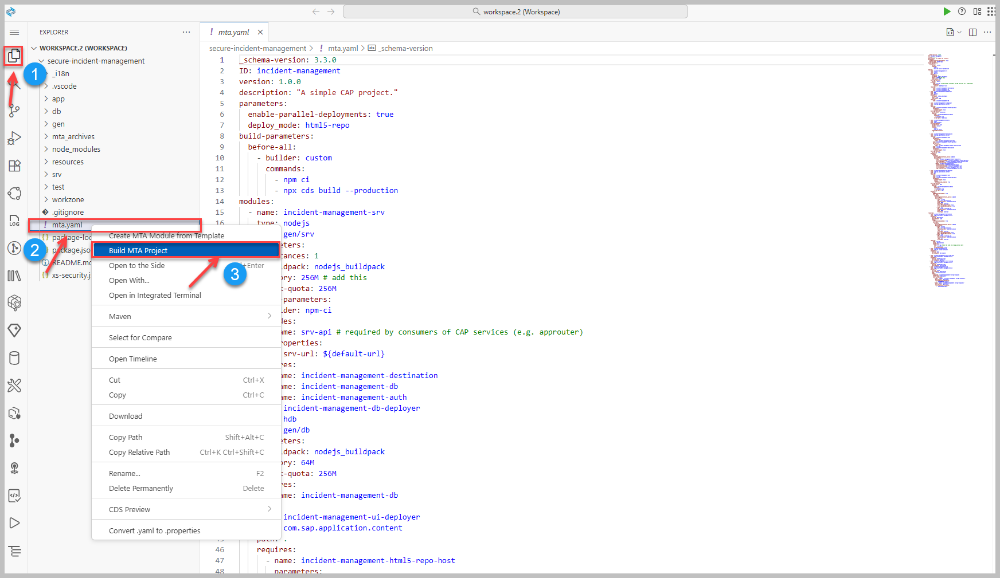
  <br>
  <b></b>
</p>

**Option 2: Using the Command Line**
  * Ensure your terminal is pointed to the correct directory:**secure-incident-management**
  * Run the Cloud MTA Build Tool to generate the deployment archive:

```
mbt build
```

### 5.3.3. Deploy to Cloud Foundry
You can deploy the application using one of two methods: **via the UI** or **via the command line**.

**Option 1. Using the UI**
  * In the Explorer view, find and expand the mta_archives folder.
  * Right-click on the generated .mtar file.
  * Select **Deploy MTA Archive**.
  * If prompted  **Cloud Foundry Sign and Targets** page, choose SSO, then click Open a New Browser to generate your SSO Passcode.

  <p align="center">
    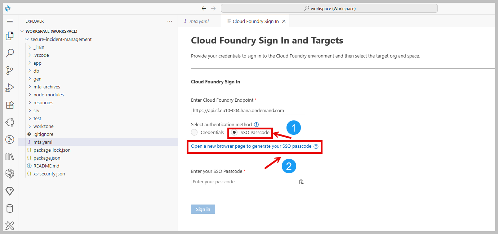
    <br>
  </p>
  
  * If prompted for login, select your **Sign in with alternative identity provider**.

  * You’ll see a passcode page — copy the temporary authentication code generated in the **Passcode** field.  <p align="center">
      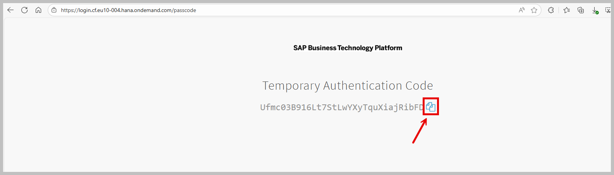
      <br>
      <b></b>
    </p>
    
  * Paste the **SSO Passcode** back into the SAP Business Application Studio and click on the **Sign In** button.
  <p align="center">
    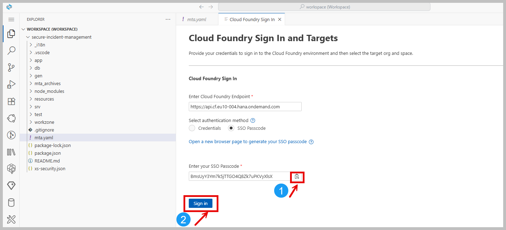
    <br>
  <b></b>
  </p>
  
  * In section **Cloud Foundry Target**, select **Organization** and **Space** (for example, `dev`), then click on the **Apply** button.
  <p align="center">
    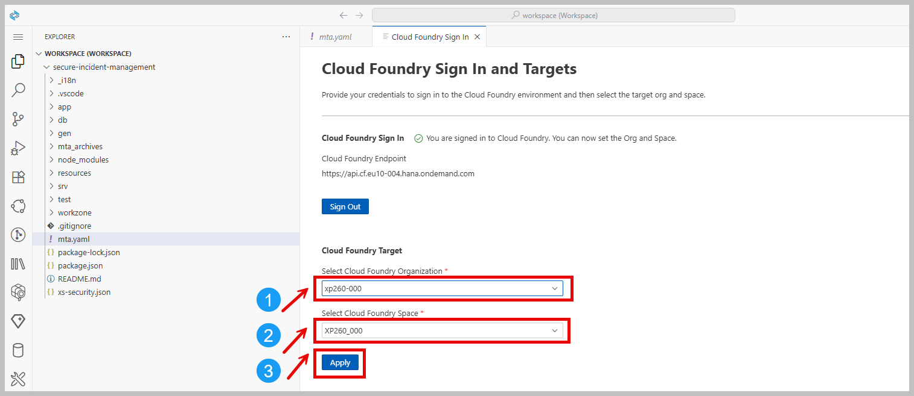
    <br>
    <b></b>
  </p>
  
  *  Once connected, a notification message pops up in the status bar in the SAP Business Application Studio confirming that your Cloud Foundry organization and space have been set and are ready for use.
  
  <p align="center">
    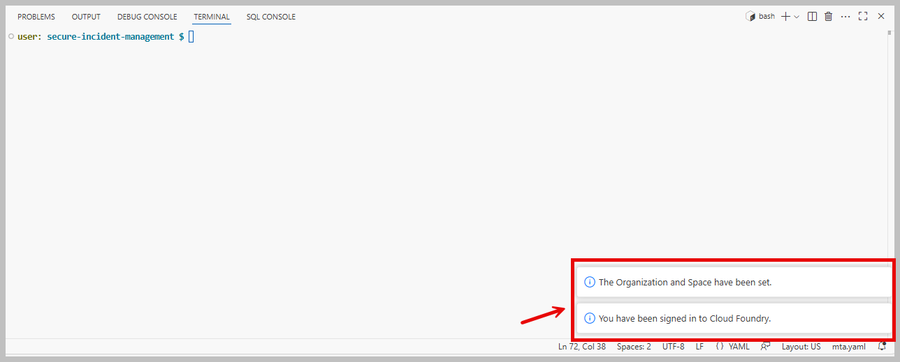
    <br>
    <b></b>
  </p>

   
  * Wait for the deployment process to complete and check the output panel for confirmation.

**Option 2. Using the Command Line**

  * Open Terminal
     - In the SAP Business Application Studio, go to **Terminal > New Terminal** from the top menu.
     - A terminal window will open at the bottom of your workspace in your project directory **secure-incident-management**.
     
  * Run the following command to log in:
    ```
    cf login --sso
    ```
  * Click on provided URL to get a one-time passcode.
  * If prompted for login, select your **Sign in with alternative identity provider**.
  * Return to terminal and type/paste the code.

  * To verify the login, run
    ```
      cf target
    ```
  * You should see the current organization and space listed.
  
  <p align="center">
    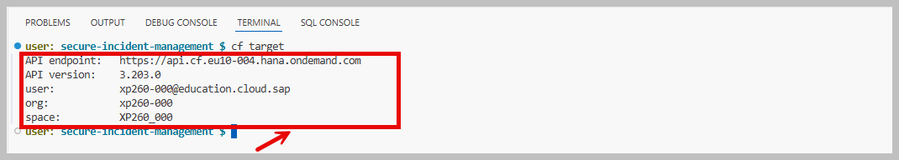
    <br>
    <b></b>
  </p>

  * Deploy the Application
```
cf deploy mta_archives/incident-management_1.0.0.mtar
```

### 5.4. Assign Role Collections to Business Users

To test real-world access control patterns, you'll work with dedicated test accounts that demonstrate proper role-based access control (RBAC). These users showcase how precise role assignments enforce the principle of least privilege in production environments:

| User | Role |
|------|------|
| `bob.smith@bestrun.com` | Support User |
| `alice.jones@bestrun.com` | Support User |
| `david.miller@bestrun.com` | Admin User |

To assign role collections using the SAP BTP Cockpit:

1. Navigate to your subaccount and go to **Security → Users**.
2. Select the target user.
3. In the details panel on the right, click **Assign Role Collection**.
4. Assign `bob.smith@bestrun.com` and `alice.jones@bestrun.com` to the **support (incident-management xxxtrial-dev)**** role collection.
5. Assign `david.miller@bestrun.com` to the  **admin (incident-management xxxtrial-dev)** role collection.

<p align="center">
  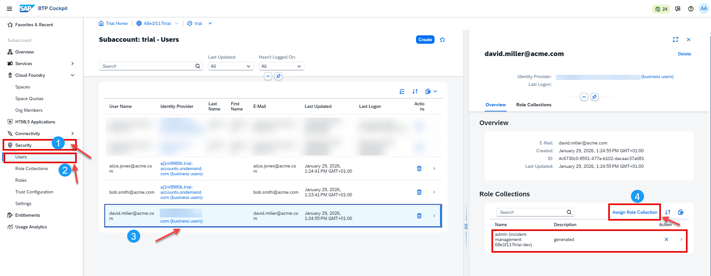
  <br>
  <b></b>
</p>

## Step 6. Integrate Your Application with SAP Build Work Zone, Standard Edition

In this section, you'll configure SAP Build Work Zone to integrate your Incident Management application in a unified launchpad experience. 
This involves updating content, organizing apps into groups, and assigning access permissions.

### 6.1. Update Content

First, ensure SAP Build Work Zone has the latest content from your HTML5 application.

1. Open your subaccount and navigate to **Instances and Subscriptions**.
2. Select **SAP Build Work Zone, standard edition**.
3. When prompted for authentication, log in using your admin credentials from the Custom Identity Provider (IdP).
4. In the left navigation menu, choose the **Channel Manager** icon.
5. Choose **Fetch Updated Content** to sync the latest application metadata.

<p align="center">
  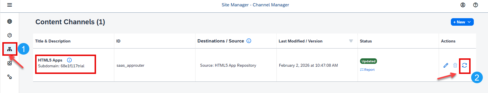
  <br>
  <b></b>
</p>

### 6.2. Add Application to Content Explorer

Now, make your application available for inclusion in the Work Zone content catalog.

1. In the left navigation menu, choose **Content Manager** → **Content Explorer**.
2. Select the tile labeled **HTML5 Apps** with your subdomain name.
3. In the items table, locate **incident-management** and select its checkbox.
4. Choose **Add** to import the application into your content catalog.

<p align="center">
  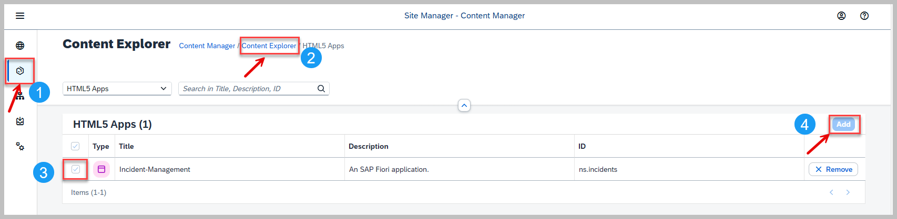
  <br>
  <b></b>
</p>

### 6.3. Create a Group

Create a group to organize related applications together in the launchpad.

1. Return to **Content Manager** and choose **Create** → **Group**.
2. In the **Group Title** field, enter: `Incident Management Group`
3. Assign the **Incident-Management** app to this group.
4. Choose **Save**.
5. 

<p align="center">
  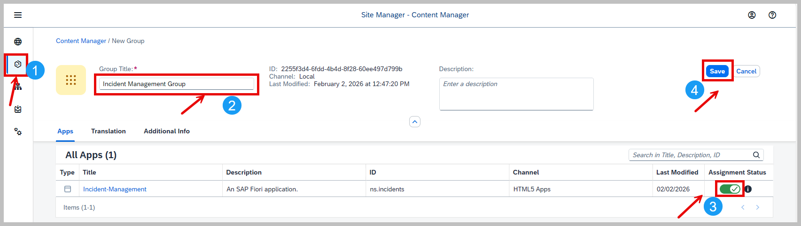
  <br>
  <b></b>
</p>

### 6.4. Add Application to the Everyone Role

> **Note**: The "Everyone" role in Work Zone determines:
> - ✅ Whether the app appears in the launchpad
> - ✅ Which users can see and launch the application
> - This is a **visibility/launchpad permission**
> - Role collections (Support/Admin) control what users can do **inside** the application, while the Everyone role controls whether they can access it at all.

1. In **Content Manager**, select the **Everyone** role and choose **Edit**.
2. Under **Assignment Status**, assign the **Incident-Management** app to the role.
3. Choose **Save**.

<p align="center">
  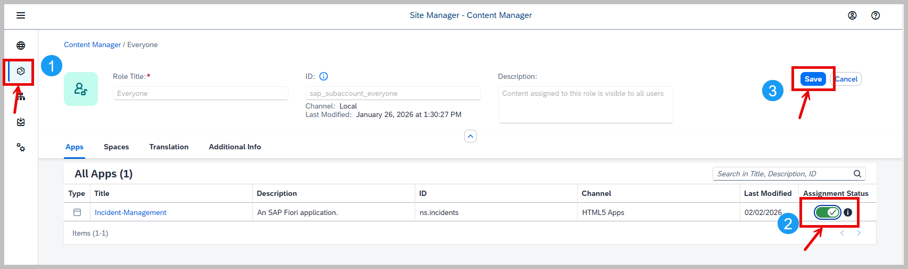
  <br>
  <b></b>
</p>


### 6.5. Create a Site

Build a dedicated launchpad site for your Incident Management application.

1. Navigate to **Site Directory** and choose **Create Site**.
2. In the **Site Name** field, enter: `Incident Management Site`
3. Choose **Create**.
4. Return to the Site Directory and locate your new site.
5. Choose **Go Site** to launch the launchpad.

<p align="center">
  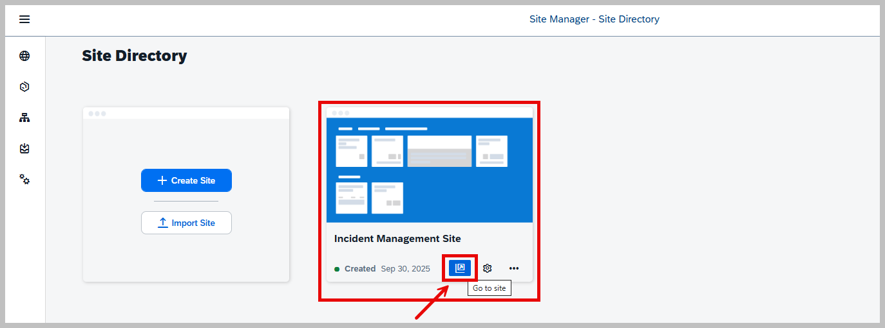
  <br>
  <b></b>
</p>

The Incident Management application launchpad should now open.

### 6.6. Verify Access with Different Users

> ⚠️ Before opening the incident-management-application, ensure all backend services are running.

#### 6.6.1. Check and Start SAP HANA Database
  1. In the left navigation menu, go to **Instances and Subscriptions** → **Applications**.
  2. Locate the **`incident-management-srv`** application.
  3. Check the **Status**:
     - 🟢 **Running** → Proceed to Section 6.6.2
     - 🔴 **Stopped** → Select the database → choose **Start**
         - Monitor the Status column closely, it will first change to "Starting" (yellow indicator), then to 🟢 **Running** after 2–5 minutes.
         - Do not proceed until it fully reaches Running, as the database needs time to initialize.

#### 6.6.2. Check and Start the incident-management-srv Application
  1. Navigate to your subaccount.
  2. In the left navigation, go to **Cloud Foundry → spaces**.
  3. Select your Space (e.g., dev or the space where the application was deployed).
  4. In the Applications list, search for incident-management-srv.
  5. In the **Applications** list, search for **incident-management-srv**.
  2. Check the **State** or **Status** column:
   - 🟢 **Started** (or **Running**)  
     → The application is active and ready. Proceed to **Step 4** for verification.
   - 🔴 **Stopped**  
     → The application is not running. Click the **Start** button to start it.

#### 6.6.3. Verify Business User Access to the Incident Management Application
  1. return to the **Incident Management application** launchpad tab.
  2. When the **Incident Management tile** is displayed, **Sign Out** from your current IDP user admin and login to the application with the designated test users to confirm role-based permissions are working correctly

| User | Role | Password |
|------|------|----------|
| `alice.jones@bestrun.com` | Support | `your initial password` |
| `bob.smith@bestrun.com` | Support | `your initial password` |
| `david.miller@bestrun.com` | Admin | `your initial password` |

<p align="center">
  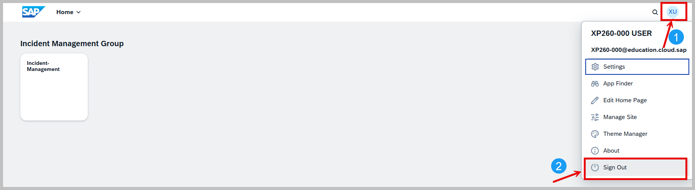
  <br>
  <b></b>
</p>

  3. Click on the tile to open the incident management application and **bookmark the URL**. 

<p align="center">
  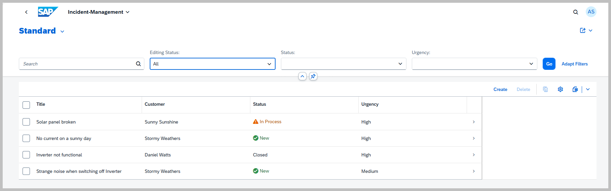
  <br>
  <b></b>
</p>


Now you are ready to start the exercises. 


## Summary

Congratulations! You've successfully completed the environment setup and initial deployment for the Secure Incident Management application on SAP BTP.
continue to - [Exercise 1 - Broken Access Control](../ex1/README.md)
